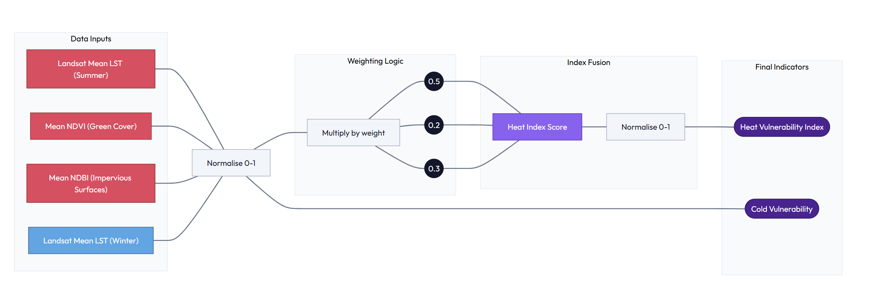
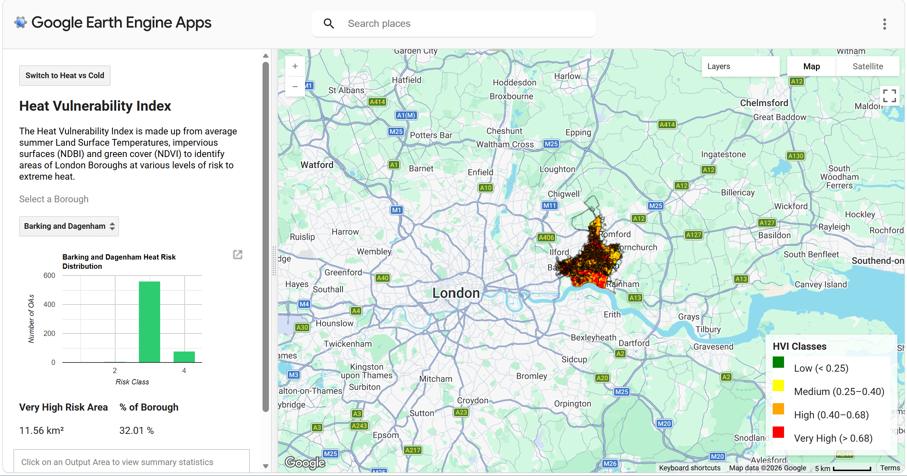
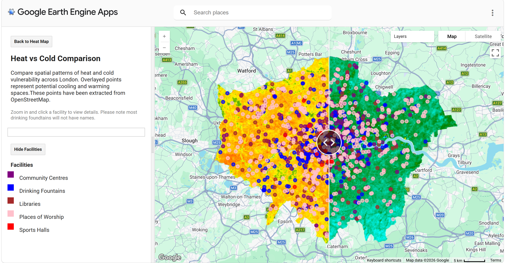

::: hero-banner
<h1>🌡️ Mapping London Thermal Vulnerability</h1>

<p>An interactive Google Earth Engine application identifying where
Londoners face the greatest combined burden of extreme heat, extreme
cold and inadequate access to public shelter.</p>
:::

------------------------------------------------------------------------

## Project Summary

This project aims to identify spatial inequalities in thermal exposure
across London by mapping areas that experience the highest temperatures
during heat events and the lowest temperatures during cold periods.
These environmental patterns are analysed alongside the distribution of
publicly accessible shelters (cool spaces and warm spaces) and
demographic vulnerability indicators derived from census data.

By integrating climate, accessibility, and socio-demographic data, the
project highlights where vulnerable populations may be
disproportionately exposed to extreme temperatures and where gaps in
shelter provision exist.

------------------------------------------------------------------------

### Problem Statement

Extreme heat and cold events are increasing in frequency and intensity
due to climate change, posing significant risks to public health,
particularly for vulnerable populations such as the elderly, young
children, and those with underlying health conditions.

While local authorities and organisations provide “cool spaces” and
“warm spaces” to mitigate these risks, there is currently no clear,
London-wide understanding of:

-   Where the most thermally extreme areas are

-   How accessible shelters are from these areas

-   Whether vulnerable populations are adequately served

This lack of integrated spatial insight limits the ability of
policymakers and local authorities to target interventions effectively,
potentially leaving high-risk communities under-served.

### End Users

Council officers can use this heat‑mapping tool to pinpoint where land
surface temperatures, heat exposure, and vulnerable populations are most
concentrated, enabling targeted action in departments including
planning, housing, transport, and public health.

This interactive map application will guide climate‑resilience funding
bids, inform planning decisions on overheating and identify homes and
infrastructure at risk.

The Application can also support external organisations operating at a
London-wide level such as the GLA to inform their heat risk and
resilience strategies.

-   **Sustainability and Planning -** Climate‑resilience funding bids
    and prioritises adaptation projects (trees, shading, cool roofs,
    green infrastructure). Informs planning decisions on overheating
    risk and ensures compliance with London Plan policies. 
-   **Building Control & Housing Teams -** Highlights homes at risk of
    indoor overheating to target retrofit programmes. 
-   **Public Health & Adult Social Care -** Locates heat‑sensitive
    populations to guide heatwave response, cooling centres. 

## Data

| Category | Dataset | Calculation / Use | Description | Source |
|--------------|--------------|--------------|--------------|--------------|
| GEE — Landsat 8 | Land Surface Temperature (LST) | Summer (Jun–Aug) and Winter (Dec–Feb) median composites, 2013–2023. ST_B10 converted from Kelvin to Celsius using Collection 2 scale factors. | Thermal infrared data at 30 m resolution r epresenting the radiometric temperature of the land surface. | [L ink](https:%20//developer%20s.google.co%20m/earth-eng%20ine/dataset%20s/catalog/L%20ANDSAT_LC08%20_C02_T1_L2) |
| GEE — Landsat 8 | NDVI | Normalised Difference Vegetation Index from SR_B5 (NIR) and SR_B4 (Red). Low NDVI, high urban heat exposure. | Proxy for vegetation density; inversely related to UHI intensity. | [Link](https:%20//developer%20s.google.co%20m/earth-eng%20ine/dataset%20s/catalog/L%20ANDSAT_LC08%20_C02_T1_L2) |
| GEE — Landsat 8 | NDBI | Normalised Difference Built-up Index from SR_B6 and SR_B5 (NIR). High NDBI, greater built-up surface cover. | Proxy for impervious surface extent; positively correlated with heat retention. | [Link](https:%20//developer%20s.google.co%20m/earth-eng%20ine/dataset%20s/catalog/L%20ANDSAT_LC08%20_C02_T1_L2) |
| ONS Census 2021 | Age structure per Output Area | Percentage of population aged 0–19 and 65+ per OA, used as demographic vulnerability indicators. | 2021 Census age -by-five-ye ar-age-band data for all London Output Areas (\~25,000 OAs). | [Link](ht%20tps://www.o%20ns.gov.uk/p%20eoplepopula%20tionandcomm%20unity/popul%20ationandmig%20ration/popu%20lationestim%20ates/adhocs%20/15432ts007%20acensus2021%20agebyfiveye%20aragebands) |
| OpenStreetMap (OSM) | Community Facilities. | Calculation/Use: Extracted points representing publicly accessible buildings (e.g. libraries, community centres, leisure centres, places of worship). Used to identify nearest facilities to the more affected areas. | Open, crowd-sourced geospatial dataset providing comprehensive coverage of civic and community infrastructure. Acts as a proxy dataset for potential shelter locations where official registers are incomplete or unavailable. | [Link](https%20://www.open%20streetmap.o%20rg/#map=5/5%204.90/-3.43) |
| Boundaries | London Boroughs & Output Areas | Used as the geographic framework for analysis aggregation and user interface queries. | Official boundary files for the 32 London Boroughs and \~25,000 Output Areas from the ONS Open Geography Portal. | [Link](http%20s://geoport%20al.statisti%20cs.gov.uk/) |

------------------------------------------------------------------------

## Methodology

**Heat Vulnerability Index**

To build our Heat Vulnerability Index (HVI) , we drew on research from
Krenz & Amann (2025) looking at the Urban Heat Island effect and it's
interaction with socio-demographic disparities across London. We adopted
the same age group definitions to represent vulnerability, enabling our
application to display the proportion of older and younger populations
at a granular Output Area (OA) level.

We also built on Roberts et.al (2025), who developed a PCA-based HVI for
Hackney at OA level, focusing on the 2022 heatwave. Extending this
approach we applied an OA level classification across all London
boroughs.

Our HVI is derived from Landsat 8 data. We calculated:

-   10-year mean summer Land Surface Temperatures (LST)

-   Impervious surfaces using the Normalised Difference Built-up Index
    (NDBI)

-   Green cover using the Normalised Difference Vegetation Index (NDVI)

These variables were normalised, weighted and combined to produce the
HVI. The final raster was resampled to 50m x 50m to balance spatial
granularity and application performance.



We then monitored our histogram distribution of this raster dataset and
classified it into 4 risk classes:

-   0-0.25 low risk

-   0.25-0.40 medium risk

-   0.4-0.68 high risk

-   0.68-1 very high risk

Following this the data is combined with the OA data set to calculate a
mean score per Output Area, and joined with ONS age data to create the
precomputed assets for the final application.

::: {.scroll-container style="overflow-y: scroll; height: 420px; padding: 20px;"}
``` javascript
//Add london boundaries and ONS DATA
var london = ee.FeatureCollection('projects/casa0025-spatial-applications/assets/dissolved_oas');
var london_boroughs = ee.FeatureCollection('projects/casa0025-spatial-applications/assets/london_boroughs');
var london_oas = ee.FeatureCollection('projects/casa0025-spatial-applications/assets/london_oas_corrected');
var ons_vulnerable_age = ee.FeatureCollection('projects/casa0025-spatial-applications/assets/ons_vulnerable_age');

//Set map center
Map.setCenter(-0.2687, 51.5796, 5);
Map.addLayer(london, {}, 'London');

//Define dates
var start = '2013-01-01';
var end = '2023-12-31';

//////////////////////// FUNCTIONS ///////////////////////////
//Create functions for the whole script to minimise repetition

//Scale Landsat
function applyScaleFactors(image) {
  return image
    .addBands(image.select('SR_B.').multiply(0.0000275).add(-0.2), null, true)
    .addBands(image.select('ST_B.*').multiply(0.00341802).add(149.0), null, true);
}

//Min-max stats
function getMinMax(image, band) {
  var stats = image.reduceRegion({
    reducer: ee.Reducer.minMax(),
    geometry: london,
    scale: 250,
    maxPixels: 1e13
  });
  return {
    min: ee.Number(stats.get(band + '_min')),
    max: ee.Number(stats.get(band + '_max'))
  };
}

//Normalize
function normalizeImage(image, band) {
  var stats = getMinMax(image, band);
  return image.subtract(stats.min)
              .divide(stats.max.subtract(stats.min))
              .rename(band + '_norm');
}

//Creating index (NDVI/NDBI)
function addIndex(collection, bands, name) {
  return collection.map(function(img) {
    return img.normalizedDifference(bands)
      .rename(name)
      .copyProperties(img, ['system:time_start']);
  });
}

//////////////// SUMMER DATA///////////////
//Load landsat
var landsat = ee.ImageCollection('LANDSAT/LC08/C02/T1_L2')
  .filterDate(start, end)
  .filter(ee.Filter.calendarRange(6, 8, 'month'))
  .filterBounds(london)
  .filter(ee.Filter.lt('CLOUD_COVER', 1))
  .map(applyScaleFactors);

//Get land surface temperatures convert to Celcius
var lst = landsat.select('ST_B10')
  .map(function(img) { return img.subtract(273.15); });

var lst_mean = lst.mean().clip(london);
var lst_norm = normalizeImage(lst_mean, 'ST_B10');

//NDVI
var ndvi_mean = addIndex(landsat, ['SR_B5','SR_B4'], 'NDVI')
  .mean().clip(london);

var ndvi_norm = normalizeImage(ndvi_mean, 'NDVI');

//NDBI
var ndbi_mean = addIndex(landsat, ['SR_B6','SR_B5'], 'NDBI')
  .mean().clip(london);

var ndbi_norm = normalizeImage(ndbi_mean, 'NDBI');

//Resample all layers 
var scale = 50;
var crs = 'EPSG:4326';

var lst_r   = lst_norm.reproject({crs: crs, scale: scale});
var ndvi_r  = ndvi_norm.reproject({crs: crs, scale: scale});
var ndbi_r  = ndbi_norm.reproject({crs: crs, scale: scale});

///////////////// HEAT INDEX //////////////////////
//Build Heat Index
var heatIndex = lst_r.multiply(0.5)
  .add(ndbi_r.multiply(0.3))
  .add(ee.Image(1).subtract(ndvi_r).multiply(0.2))
  .rename('heat_index');

//Normalize final
var heat_norm = normalizeImage(heatIndex, 'heat_index');

//Add visual map to check
Map.addLayer(heat_norm, {
  min: 0, max: 1,
  palette: ['green','yellow','orange','red']
}, 'Heat Vulnerability Index');

//Check data distribution with histogram 
print(ui.Chart.image.histogram({
  image: heat_norm,
  region: london,
  scale: 30,
  maxPixels: 1e10
}).setOptions({
  title: 'HVI Histogram',
  hAxis: {title: '0–1'},
  vAxis: {title: 'Frequency'}
}));

/////////////////// HEAT RISK CLASSES LAYER //////////////
//Calculate heat classes based on histogram 
var heatZones = heat_norm
  .where(heat_norm.lt(0.25), 1)
  .where(heat_norm.gte(0.25).and(heat_norm.lt(0.4)), 2)
  .where(heat_norm.gte(0.4).and(heat_norm.lt(0.68)), 3)
  .where(heat_norm.gte(0.68), 4)
  .rename('heat_zone')
  .clip(london);

//Add to map to check 
Map.addLayer(heatZones, {
  min:1, max:4,
  palette:['green','yellow','orange','red']
}, 'Heat Classes');

////////////////// EXPORTS /////////////////////////
//Export data 
Export.image.toAsset({
  image: heat_norm,
  description: 'HVI_continuous',
  assetId: 'users/piezajulia/10_year_HVI_continuous',
  region: london.geometry(),
  scale: 50,
  maxPixels: 1e13
});

Export.image.toAsset({
  image: heatZones.toInt(),
  description: 'HVI_classes',
  assetId: 'users/piezajulia/10_year_HVI_classes',
  region: london.geometry(),
  scale: 50,
  maxPixels: 1e13
});

///////////////////// OUTPUT AREAS //////////////////
//Create OA variable, simplify geometric boundaries for speed, prep join id column
var oa = london_oas.select(['OA21CD'])
  .map(function(f) {
    return f.simplify(20)
      .set('join_id', ee.String(f.get('OA21CD')).trim().toUpperCase());
  });

//Calculate mean HVI per OA
var oa_hvi = heat_norm.reduceRegions({
  collection: oa,
  reducer: ee.Reducer.mean(),
  scale: 50
}).map(function(f){
  return f.set('HVI_mean', f.get('mean'))
          .select(['OA21CD','HVI_mean']);
});

////////////////// ONS AND OA DATA //////////////////////
// Clean ONS table (handle BOM due to the CSV being UTF8)
var onsClean = ons_vulnerable_age.map(function(f) {

  var id = ee.Algorithms.If(
    f.get('OA21CD'),
    f.get('OA21CD'),
    f.get('OA21CD')
  );

  return f.set({
    join_id: ee.String(id).trim().toUpperCase(),
    percentage_old: ee.Number.parse(f.get('percentage_old')),
    percentage_young: ee.Number.parse(f.get('percentage_young'))
  });
});

//Clean OA table
var oaClean = oa_hvi.map(function(f) {
  return f.set({
    join_id: ee.String(f.get('OA21CD'))
      .trim()
      .toUpperCase()
  });
});

//Join
var joined = ee.Join.inner().apply(
  oaClean,
  onsClean,
  ee.Filter.equals({
    leftField: 'join_id',
    rightField: 'join_id'
  })
);

//Merge properties 
var oa_joined = joined.map(function(f) {
  var oaFeat = ee.Feature(f.get('primary'));
  var onsFeat = ee.Feature(f.get('secondary'));
  return oaFeat.copyProperties(onsFeat);
});

//Final clean table with relevant columns
var oa_final = oa_joined.map(function(f) {
  return f.select([
    'OA21CD',
    'HVI_mean',
    'percentage_old',
    'percentage_young'
  ]);
});

//Export
Export.table.toAsset({
  collection: oa_final,
  description: '10_year_OA_HVI_ONS_CLEAN',
  assetId: 'users/piezajulia/10_year_OA_HVI_ONS_CLEAN'
});

```

### 
:::

**Cold Risk**

In addition to heat vulnerability, we considered exposure to cold
temperatures, which is an increasing priority for London Local
Authorities supporting winter 'Warm Spaces'.

Rather than a composite index, we used mean winter LST as a proxy for
cold risk. This provides a baseline view of colder areas, with scope for
future enhancement through additional datasets such as building age,
energy efficiency, and fuel poverty.

Our aim is to help identify areas where heat and cold vulenrabilities
overlap, supporting more targeted placement of both cooling and warming
infrastructure.

::: {.scroll-container style="overflow-y: scroll; height: 380px; padding: 20px;"}
``` javascript
////////////////////// WINTER DATA/////////////////////////
//Landsat winter temperatures - December to Feb
var winter = ee.ImageCollection('LANDSAT/LC08/C02/T1_L2')
  .filterDate(start, end)
  .filter(ee.Filter.or(
    ee.Filter.calendarRange(12,12,'month'),
    ee.Filter.calendarRange(1,2,'month')))
  .filterBounds(london)
  .filter(ee.Filter.lt('CLOUD_COVER', 25))
  .map(applyScaleFactors);

//LST Winter temperatures Celcius
var lst_winter = winter.select('ST_B10')
  .map(function(img){ return img.subtract(273.15); })
  .mean()
  .rename('LST')
  .clip(london);
  
//Normalise
var cold_norm = normalizeImage(lst_winter, 'LST')
  .multiply(-1).add(1)
  .rename('cold_index');

//Add layer to check
Map.addLayer(cold_norm, {
  min:0, max:1,
  palette:['yellow','green','cyan','blue','purple']
}, 'Cold Vulnerability');

//Export 
Export.image.toAsset({
  image: cold_norm,
  description: 'Cold_Vulnerability',
  assetId: 'users/piezajulia/10year_cold_vulnerability',
  region: london.geometry(),
  scale: 50,
  maxPixels: 1e13
});

```
:::

## Interface

The application provides a simple interface where users can select a
London borough and view summary statistics for both heat and cold
vulnerability.

**Heat Vulnerability Index (View)**

We focus on granular insights at the OA level (typically 40-250
households, or 100-625 residents). For each borough, a chart shows the
distribution of heat risk across OAs, based on mean HVI scores.



**Heat vs Cold (View)**

This view allows users to compare heat and cold risk using a slider
between maps. We also incorporate potential cool and warm spaces sourced
from OpenStreetMap, enabling policymakers, planners and third-sector
organisations to assess existing infrastructure that could help mitigate
risk.



------------------------------------------------------------------------

## The Application

### Key capabilities

**Borough summary statistics**

We estimate the area (km2) of each borough classified as very high risk
and express this as a percentage of total area, helping identify where
intervention may be most needed.

**Toggle 'Very High Risk'**

This feature isolates Class 4 (Very High Risk) areas by hiding other
layers, allowing users to focus on the highest-risk zones.

**OA interactive view and summary**

Users can click on an OA to view key statistics, including mean HVI and
the proportion of younger and older populations, supporting detailed
local risk assessment.

::: column page

::: app-frame
<iframe src="https://casa0025-spatial-applications.projects.earthengine.app/view/casa0025thelocalearthauthority" width="100%" height="800px" style="border: none; border-radius: 8px; box-shadow: 0 4px 6px rgba(0,0,0,0.1);">

</iframe>
:::

:::

------------------------------------------------------------------------

## How It Works

To ensure performance and interactivity, the application relies on
precomputed layers that are loaded into the interface.

**Precomputed layers**

-   Heat Vulnerability Index raster

-   HVI Classification layer

-   Mean HVI per OA

-   Cold Vulnerability Raster

-   ONS Age vulnerability data (Census 2021)

These layers are imported into the interface script which is presented
below. This script builds our content panel and our two view pages for
HVI and Heat v Cold comparison with our OpenStreetMap facilities data.

The application interface is divided into a two page view, our Heat
Vulnerability Index page and our Heat v Cold Comparison page which
allows users to investigate cool and warm facilities across London.

::: {.scroll-container style="overflow-y: scroll; height: 320px; padding: 20px;"}
``` javascript
//Import boundaries:
var london_boroughs = ee.FeatureCollection('projects/casa0025-spatial-applications/assets/london_boroughs');
var london = ee.FeatureCollection('projects/casa0025-spatial-applications/assets/dissolved_oas');

//Import facilities:
var community_centres = ee.FeatureCollection('projects/casa0025-spatial-applications/assets/community_centres');
var libraries = ee.FeatureCollection('projects/casa0025-spatial-applications/assets/libraries');
var drinking_fountains = ee.FeatureCollection('projects/casa0025-spatial-applications/assets/drinking_fountains');
var places_of_worship = ee.FeatureCollection('projects/casa0025-spatial-applications/assets/places_of_worship')
var sports_halls = ee.FeatureCollection('projects/casa0025-spatial-applications/assets/sports_halls');

//Import HVI data:
var hvi = ee.Image('users/piezajulia/10_year_HVI_continuous');
var hvi_classes = ee.Image('users/piezajulia/10_year_HVI_classes');
var oa_data = ee.FeatureCollection('users/piezajulia/10_year_OA_HVI_ONS_CLEAN');
var oa_hvi = ee.FeatureCollection('users/piezajulia/10_year_oa_hvi_mean');

//Import cold risk data:
var cold_index = ee.Image('users/piezajulia/10year_cold_vulnerability');

//Import census data:
var ons_vulnerable_age = ee.FeatureCollection('projects/casa0025-spatial-applications/assets/ons_vulnerable_age');

////////// Initial setup of the application //////////////////
ui.root.clear();

//Create Panels
var mapPanel = ui.Panel({style: {stretch: 'both'}});
var sidePanel = ui.Panel({
  style: {width: '30%', padding: '15px'}
});

//Define split panel for content
var app = ui.SplitPanel({
  firstPanel: sidePanel,
  secondPanel: mapPanel,
  orientation: 'horizontal',
  wipe: false
});

ui.root.add(app);

//Create main map and center on London
var map = ui.Map();
map.setCenter(-0.2687, 51.5796, 10);

//Set default page as Heat
var currentMode = 'heat';
var showVHI = false;
var currentBorough = null;
var showPoints = true;

//Create toggle button between two pages of the application
var toggleButton = ui.Button({
  label: 'Switch to Heat vs Cold',
  onClick: function () {
    if (currentMode === 'heat') {
      buildComparisonMap();
      toggleButton.setLabel('Back to Heat Map');
      currentMode = 'compare';
    } else {
      buildHeatMap();
      toggleButton.setLabel('Switch to Heat vs Cold');
      currentMode = 'heat';
    }
  }
});

//OA classification based on heat vulnerability index
var oa_classified = oa_data.map(function(f) {
  var hviVal = ee.Number(f.get('HVI_mean'));
  var zone = ee.Number(
    ee.Algorithms.If(hviVal.lt(0.25),1,
    ee.Algorithms.If(hviVal.lt(0.4),2,
    ee.Algorithms.If(hviVal.lt(0.68),3,4)))
  );
  return f.set('heat_class', zone);
});

/////// First Page ///////////
//Create Heat Vulnerability Index Page
function buildHeatMap() {

  mapPanel.clear();
  mapPanel.add(map);
  
  map.layers().reset();
  
  var legend = ui.Panel({
  style: {
    position: 'bottom-right',
    padding: '8px 10px',
    backgroundColor: 'rgba(255,255,255,0.8)'}
  });

  legend.add(ui.Label({
  value: 'HVI Classes',
  style: {fontWeight: 'bold', margin: '0 0 6px 0'}
  }));

  var colors = ['green', 'yellow', 'orange', 'red'];
  var names = [
  'Low (< 0.25)',
  'Medium (0.25–0.40)',
  'High (0.40–0.68)',
  'Very High (> 0.68)'
  ];

  for (var i = 0; i < 4; i++) {

  var colorBox = ui.Label({
    style: {
      backgroundColor: colors[i],
      padding: '8px',
      margin: '0 6px 0 0'
    }
  });

  var description = ui.Label(names[i]);

  var row = ui.Panel({
    widgets: [colorBox, description],
    layout: ui.Panel.Layout.Flow('horizontal')
  });

  legend.add(row);
  }

  //Clear widget before adding legend
  map.widgets().reset();

  //Add legend to map
  map.add(legend);
  
  //Add side panel content
  sidePanel.clear();

  sidePanel.add(toggleButton);

  sidePanel.add(ui.Label('Heat Vulnerability Index', {
    fontWeight: 'bold',
    fontSize: '20px'
  }));
  
    sidePanel.add(ui.Label('The Heat Vulnerability Index is made up from average summer Land Surface Temperatures, impervious surfaces (NDBI) and green cover (NDVI) to identify areas of London Boroughs at various levels of risk to extreme heat.', {
  fontSize: '13px',
  color: 'black',
}));
  
  sidePanel.add(ui.Label('Select a Borough', {
  fontSize: '13px',
  color: 'grey',
}));
  
  //Dropdown
  var dropdown = ui.Select({placeholder: 'Select borough'});
  sidePanel.add(dropdown);

  //Containers for chart and area calculations
  var chartContainer = ui.Panel();
  var areaContainer = ui.Panel({
    layout: ui.Panel.Layout.flow('horizontal')
  });

  sidePanel.add(chartContainer);
  sidePanel.add(areaContainer);
  
//Create OA info panel (inside content panel)
var oaInfoPanel = ui.Panel({
  style: {
    margin: '10px 0',
    padding: '10px',
    border: '1px solid #ccc'
  }
});

sidePanel.add(oaInfoPanel);

oaInfoPanel.add(ui.Label(
  'Click on an Output Area to view summary statistics',
  {
    color: 'grey',
    fontSize: '12px',
    margin: '0 0 8px 0'
  }
));

//Prevent multiple handlers stacking when rebuilding map
map.unlisten('click');

map.onClick(function(coords) {

  var point = ee.Geometry.Point([coords.lon, coords.lat]);

  var clickedOA = oa_classified.filterBounds(point).first();

  clickedOA.evaluate(function(f) {

    oaInfoPanel.clear();

    if (!f) {
      oaInfoPanel.add(ui.Label('No Output Area found'));
      return;
    }

    oaInfoPanel.add(ui.Label('Output Area Info', {
      fontWeight: 'bold',
      fontSize: '14px'
    }));

    oaInfoPanel.add(ui.Label('OA Code: ' + f.properties.OA21CD));
    oaInfoPanel.add(ui.Label('Mean HVI: ' + Number(f.properties.HVI_mean).toFixed(2)));
    oaInfoPanel.add(ui.Label('% Older: ' + Number(f.properties.percentage_old).toFixed(2)));
    oaInfoPanel.add(ui.Label('% Younger: ' + Number(f.properties.percentage_young).toFixed(2)));
  });
});

//Create button to show very high risk areas (Class 4 of HVI)
  var vhiToggle = ui.Button({
    label: 'Show Very High Risk Only',
    onClick: function() {

      showVHI = !showVHI;

      vhiToggle.setLabel(
        showVHI ? 'Show Full HVI' : 'Show Very High Risk Only'
      );

      if (currentBorough) {
        updateBorough(currentBorough);
      }
    }
  });

  sidePanel.add(vhiToggle);

  //Dropdown for boroughs to update charts
  dropdown.onChange(function(name) {
    currentBorough = name;
    updateBorough(name);
    showChart(name);
    updateVeryHighArea(name);
  });

  london_boroughs.aggregate_array('NAME').sort().evaluate(function(list){
    dropdown.items().reset(list);
    dropdown.setValue(list[0], true);
  });

  //Update boroughs function to show layers in the application
  //This enables switching between HVI and Very High Risk views
  function updateBorough(name) {

    currentBorough = name;
  //london borough geometries to filter with map
    var boroughGeom = london_boroughs
      .filter(ee.Filter.eq('NAME', name))
      .geometry();

    map.centerObject(boroughGeom, 10);
    map.layers().reset();

    var oaFiltered = oa_classified.filterBounds(boroughGeom);
  //style output areas
    var oaStyled = oaFiltered.map(function(f) {
      return f.set({
        style: {
          color: 'black',
          width: 0.5,
          fillColor: '00000000'
        }
      });
    });

    if (showVHI) {
  //show very high risk area else show london borough HVI
      var class4 = hvi_classes
        .eq(4)
        .selfMask()
        .clip(boroughGeom);

      map.addLayer(class4, {palette: ['red']}, 'Very High Risk');

    } else {

      map.addLayer(hvi.clip(boroughGeom), {
        min: 0,
        max: 1,
        palette: ['green','yellow','orange','red']
      }, 'HVI');

      map.addLayer(hvi_classes.clip(boroughGeom), {
        min: 1,
        max: 4,
        palette: ['green','yellow','orange','red']
      }, 'HVI Classes');

      map.addLayer(
        oaStyled.style({styleProperty: 'style'}),
        {},
        'OA Boundaries'
      );
    }

    showChart(name);
    updateVeryHighArea(name);
  }

  //Chart functions, count of classes
  function getClassCounts(name) {

    var borough = london_boroughs
      .filter(ee.Filter.eq('NAME', name))
      .geometry();

    var data = oa_classified.filterBounds(borough);
    var classes = ee.List.sequence(1, 4);

    var counts = classes.map(function(i) {
      i = ee.Number(i);
      var count = data.filter(ee.Filter.eq('heat_class', i)).size();
      return ee.Feature(null, {class: i, count: count});
    });

    return ee.FeatureCollection(counts);
  }

  //Chart function, gets class chart to display
  function showChart(name) {

    var fc = getClassCounts(name);

    var chart = ui.Chart.feature.byFeature(fc, 'class', ['count'])
      .setChartType('ColumnChart')
      .setOptions({
        title: name + ' Heat Risk Distribution',
        legend: {position: 'none'},
        colors: ['#2ECC71','#F1C40F','#E67E22','#C0392B'],
        hAxis: {title: 'Risk Class'},
        vAxis: {title: 'Number of OAs'}
      });

    chartContainer.clear();
    chartContainer.add(chart);
  }

  //Calculating very high area summary statistics
  function updateVeryHighArea(name) {

    var boroughGeom = london_boroughs
      .filter(ee.Filter.eq('NAME', name))
      .geometry();
  //Mask Class 4 very high risk areas
    var mask = hvi_classes.eq(4).selfMask().clip(boroughGeom);
  //update the image on the map
    var areaImage = ee.Image.pixelArea().updateMask(mask);
  //calculate area statistics function
    var areaStats = areaImage.reduceRegion({
      reducer: ee.Reducer.sum(),
      geometry: boroughGeom,
      scale: 100,
      maxPixels: 1e13
    });
  //calculate m2 and km2
    var area_m2 = ee.Number(areaStats.get('area'));
    var area_km2 = area_m2.divide(1e6);
  //calculate total area
    var totalArea = ee.Image.pixelArea().reduceRegion({
      reducer: ee.Reducer.sum(),
      geometry: boroughGeom,
      scale: 100,
      maxPixels: 1e13
    });

    var total_m2 = ee.Number(totalArea.get('area'));
    var percent = area_m2.divide(total_m2).multiply(100);

    area_km2.evaluate(function(a) {
      percent.evaluate(function(p) {

        areaContainer.clear();
        //add total area to view in the content panel
        areaContainer.add(ui.Panel([
          ui.Label('Very High Risk Area', {fontWeight:'bold'}),
          ui.Label((a || 0).toFixed(2) + ' km²')
        ]));

        areaContainer.add(ui.Panel([
          ui.Label('% of Borough', {fontWeight:'bold'}),
          ui.Label((p || 0).toFixed(2) + ' %')
        ]));

      });
    });
  }
}

///////// SECOND PAGE /////////
//Creating Heat v Cold comparison page with potential cool and warm spaces
function buildComparisonMap() {

  mapPanel.clear();

  //Create 2 maps
  var leftMap = ui.Map();
  var rightMap = ui.Map();

  var londonGeom = london_boroughs.geometry();

  //Center on London
  leftMap.centerObject(londonGeom, 10);
  rightMap.centerObject(londonGeom, 10);

  //Link maps
  ui.Map.Linker([leftMap, rightMap]);

  //Add heat and cold maps
  leftMap.addLayer(hvi.clip(londonGeom), {
    min: 0,
    max: 1,
    palette: ['green','yellow','orange','red']
  }, 'Heat Vulnerability');

  rightMap.addLayer(cold_index.clip(londonGeom), {
    min: 0,
    max: 1,
    palette: ['yellow','green','cyan','blue','purple']
  }, 'Cold Vulnerability');

  //Style point data for imported layers for cool and warm spaces
  var communityStyled = community_centres.style({
    color: 'purple',
    pointSize: 4
  });

  var fountainsStyled = drinking_fountains.style({
    color: 'blue',
    pointSize: 4
  });

  var librariesStyled = libraries.style({
    color: 'brown',
    pointSize: 4
  });

  var worshipStyled = places_of_worship.style({
    color: 'pink',
    pointSize: 4
  });

  var sportsStyled = sports_halls.style({
    color: 'red',
    pointSize: 4
  });

  //Add points to both maps, allow them to be toggled on or off
  if (showPoints) {

    //left map
    leftMap.addLayer(communityStyled, {}, 'Community Centres');
    leftMap.addLayer(fountainsStyled, {}, 'Drinking Fountains');
    leftMap.addLayer(librariesStyled, {}, 'Libraries');
    leftMap.addLayer(worshipStyled, {}, 'Places of Worship');
    leftMap.addLayer(sportsStyled, {}, 'Sports Halls');

    //right map
    rightMap.addLayer(communityStyled, {}, 'Community Centres');
    rightMap.addLayer(fountainsStyled, {}, 'Drinking Fountains');
    rightMap.addLayer(librariesStyled, {}, 'Libraries');
    rightMap.addLayer(worshipStyled, {}, 'Places of Worship');
    rightMap.addLayer(sportsStyled, {}, 'Sports Halls');
  }

  //Split panel code with wipe function
  var split = ui.SplitPanel({
    firstPanel: leftMap,
    secondPanel: rightMap,
    orientation: 'horizontal',
    wipe: true
  });

  mapPanel.add(split);

  //Create side panel for content
  sidePanel.clear();

  sidePanel.add(toggleButton);
  //add labels and text
  sidePanel.add(ui.Label('Heat vs Cold Comparison', {
    fontSize: '20px',
    fontWeight: 'bold'
  }));

  sidePanel.add(ui.Label(
    'Compare spatial patterns of heat and cold vulnerability across London. ' +
    'Overlayed points represent potential cooling and warming spaces.'+
    'These points have been extracted from OpenStreetMap.'
  ));

  //Info panel for facility names names
 var infoPanel = ui.Panel({
    style: {
      margin: '10px 0',
      padding: '10px',
      border: '1px solid #ccc'
    }
  });

  sidePanel.add(ui.Label('Zoom in and click a facility to view details. Please note most drinking foundtains will not have names.', {
    fontSize: '12px',
    color: 'grey'
  }));

  sidePanel.add(infoPanel);

  //Point toggle button to show and hide facilities
  var togglePointsBtn = ui.Button({
    label: showPoints ? 'Hide Facilities' : 'Show Facilities',
    onClick: function() {
      showPoints = !showPoints;
      buildComparisonMap(); 
    }
  });

  sidePanel.add(togglePointsBtn);
  
  //Set up click function for facility names
  leftMap.unlisten('click');
  rightMap.unlisten('click');

  function handleClick(coords) {

  var point = ee.Geometry.Point([coords.lon, coords.lat]);
  var buffer = point.buffer(50);

  function getFeature(fc, propertyName) {
    var feat = fc.filterBounds(buffer).first();

    return ee.Algorithms.If(
      feat,
      ee.Feature(feat).get(propertyName),
      null
    );
  }
  //Click function to pull through name columns from shapefiles 
  var result = ee.Dictionary({
    community: getFeature(community_centres, 'name'),
    fountain: getFeature(drinking_fountains, 'name'),
    library: getFeature(libraries, 'name'),
    worship: getFeature(places_of_worship, 'name'),
    sports: getFeature(sports_halls, 'name')
  });
  //add function for name if exists and no facility if not
  result.evaluate(function(res) {

    infoPanel.clear();

    var found = false;

    function addIfExists(label, value) {
      if (value) {
        infoPanel.add(ui.Label(label + ': ' + value));
        found = true;
      }
    }

    addIfExists('Community Centre', res.community);
    addIfExists('Drinking Fountain', res.fountain);
    addIfExists('Library', res.library);
    addIfExists('Place of Worship', res.worship);
    addIfExists('Sports Hall', res.sports);

    if (!found) {
      infoPanel.add(ui.Label('No facility at this location'));
    }
  });
}

//Apply to both maps maps
leftMap.onClick(handleClick);
rightMap.onClick(handleClick);

//Create a legend for potential cool and warm spaces
  sidePanel.add(ui.Label('Facilities', {fontWeight: 'bold'}));

  function legendRow(color, name) {
    return ui.Panel([
      ui.Label('', {
        backgroundColor: color,
        padding: '8px',
        margin: '0 6px 4px 0'
      }),
      ui.Label(name)
    ], ui.Panel.Layout.Flow('horizontal'));
  }

  sidePanel.add(legendRow('purple', 'Community Centres'));
  sidePanel.add(legendRow('blue', 'Drinking Fountains'));
  sidePanel.add(legendRow('brown', 'Libraries'));
  sidePanel.add(legendRow('pink', 'Places of Worship'));
  sidePanel.add(legendRow('red', 'Sports Halls'));
}

//Build the application 
buildHeatMap();
```
:::

### 3. Insights and Objectives

The application surfaces three main types of insight for
decision-making:

-   **Risk prioritisation** - identifying areas within boroughs at with
    the highest heat vulnerability risk scores so that scarce resources
    available to Local Authorities can be directed to places that need
    them them most. Additional data on young and old population
    percentages at OA level also helps to prioritise areas with
    vulnerable populations.
-   **Identifying potential sites** - being able to view various types
    of community facilities enables policymakers and planners to
    investigate which sites are suitable to become cool or warm spaces.
    It also encourages more collaboration between existing organisations
    (places of worship, schools, libraries) to create more community
    provision.
-   **Seasonal comparison** - the heat and cold maps do not always
    identify the same areas as highest priority. Some inner London
    boroughs with extreme summer UHI are well-served by cool spaces;
    some outer-borough estates face cold-risk with no warm banks nearby.
    The dual-season view allows this asymmetry to be interrogated
    directly.

------------------------------------------------------------------------

## Limitations and Opportunities

**Spatial resolution** - Landsat 8’s 30 m spatial resolution means that
individual buildings, streets, and courtyards are not distinguishable.
Sub-building variability in thermal exposure (e.g., a south-facing flat
vs. a north-facing flat in the same block) is entirely invisible at this
scale. Higher-resolution thermal data (e.g., Sentinel-3 SLSTR or
commercial providers) could address this at increased cost.

**Temporal aggregation** - The multi-year summer median LST composite
captures the average thermal character of an area but will
under-represent the acute severity of individual extreme heat events,
which is precisely when risk is highest. Future work could layer in
extreme percentile composites (e.g., 95th percentile LST across the
period) in addition to the median.

**Census data lag** - The 2021 Census demographic data is now five years
old. Areas undergoing rapid demographic change (e.g.,
gentrification-driven age profile shifts) will not be accurately
represented.

**Shelter data completeness** - The OpenStreetMap dataset represents a
broad but indirect proxy for potential shelter locations. While it
provides strong coverage of community infrastructure, it does not
confirm whether a site is actively operating as a warm or cool space.
Conversely, official datasets such as GLA Cool Spaces and Warm Welcome
registers are more accurate but the data is not available for
downloading and can be incomplete and inconsistently maintained.
Combining OSM with official registers allows for a hybrid dataset that
balances coverage and accuracy. Further validation through local
authority collaboration could significantly improve reliability.

**Data maintenance and updates** - The current dataset represents a
static snapshot in time. OpenStreetMap data is continuously updated, but
manual extraction introduces the risk of data becoming outdated. This
process could be automated using OSM APIs (e.g., Overpass API) or
Scheduled data pipelines (e.g., FME, Python scripts). This would enable
the application to have regular refreshes of facility data and near
real-time updates to shelter accessibility analysis.

## References

Cutter, S.L., Boruff, B.J. and Shirley, W.L. (2003). Social
vulnerability to environmental hazards. *Social Science Quarterly*,
84(2), pp.242–261.

Greater London Authority (2024). *Properties Vulnerable to Heat Impacts
in London*. London: GLA. Available at:
https://www.london.gov.uk/sites/default/files/2024-01/24-01-16%20GLA%20Properties%20Vulnerable%20to%20Heat%20Impacts%20in%20London.pdf
\[Accessed April 2026\].

Krenz, K., & Amann, L. (2025). *Urban heat island effect: examining
spatial patterns of socio-demographic inequalities in Greater
London*. *Cities & Health*, *9*(5), 901–924.
https://doi.org/10.1080/23748834.2025.2489854

King's College London (2026). *Londoners' Experiences of Heat and
Priorities for Action*. London: KCL. Available at:
https://www.kcl.ac.uk/sfg/assets/londoners-experiences-of-heat-and-priorities-for-action.pdf
\[Accessed April 2026\].

Lambeth Climate Partnership (2025). Cooling Fiveways Project. Available
at: https://lambethclimatepartnership.org/live-project/cooling-fiveways
\[Accessed April 2026\].

Mushore, T.D., Mutanga, O. and Odindi, J. (2017). Assessing the
potential of in-situ hyperspectral remote sensing to classify and
predict land surface temperature (LST) in an urban environment. *ISPRS
Journal of Photogrammetry and Remote Sensing*, 125, pp.58–68.

Office for National Statistics (2022). *Excess Winter Mortality in
England and Wales: 2021 to 2022*. Newport: ONS.

Roberts, E., Sun, T. and Pelling, M. (2025) ‘Compound urban heat risk
revealed by co-location of social vulnerability and elevated
temperatures in London, UK: A spatial analysis’, *Sustainable Cities and
Society*, 132, p. 106756. Available at:
<https://doi.org/10.1016/j.scs.2025.106756>.

Sismanidis, P., Keramitsoglou, I. and Kiranoudis, C.T. (2017). Mapping
the spatiotemporal dynamics of Europe's land surface temperatures.
*ISPRS Journal of Photogrammetry and Remote Sensing*, 130, pp.137–146.

Tan, J., Zheng, Y., Tang, X., Guo, C., Li, L., Song, G., Zhen, X., Yuan,
D., Kalkstein, A.J., Li, F. and Chen, H. (2010). The urban heat island
and its impact on heat waves and human health in Shanghai.
*International Journal of Biometeorology*, 54, pp.75–84.

UK Health Security Agency (2022). *Heat-Mortality Monitoring Report:
Summer 2022*. London: UKHSA.

Zhu, Z. and Woodcock, C.E. (2012). Object-based cloud and cloud shadow
detection in Landsat imagery. *Remote Sensing of Environment*, 118,
pp.83–94.
